#  Template WordPress Prossima

[](https://developersitalia.slack.com/)
[](https://wordpress.org/)
[](https://www.php.net/)

## **Un template per gli Enti della Regione Umbria**

### I primi passi con il tema WordPress Prossima

**Template WordPress Prossima** è un tema WordPress riutilizzabile e sostenibile, progettato per essere facilmente adottato da enti locali, comuni e strutture della Pubblica Amministrazione che operano sotto il coordinamento della Regione Umbria. Il template aderisce al [modello di sito istituzionale](https://designers.italia.it/modello/comuni/) progettato nell'ambito del progetto Designers Italia dal Dipartimento per la trasformazione digitale.

## **Indice**

- [Premessa](#premessa)
- [Conformità alle linee guida AGID](#conformità-alle-linee-guida-agid)
- [Requisiti di hosting](#requisiti-di-hosting)
- [Installazione del template](#installazione-del-template)
- [Da dove iniziare](#da-dove-iniziare)
- [Impostazioni Template](#impostazioni-template)
- [Gestione ruoli e permessi](#gestione-ruoli-e-permessi)
- [Ottimizzazione immagini](#ottimizzazione-immagini-e-gestione-focal-point)
- [Supporto e community](#supporto-e-community)
- [FAQ](#faq)
- [Licenze](#licenze)

---

## **Premessa**

La realizzazione del template WordPress Sito Istituzionale nasce con l'obiettivo di fornire un'applicazione web riutilizzabile e sostenibile, pensata per essere facilmente adottata da enti locali, comuni e strutture della Pubblica Amministrazione che operano sotto il coordinamento della Regione Umbria, o che richiedono una soluzione digitale in linea con le direttive nazionali.

Il template è concepito come una base solida e configurabile, che consente:

- **una rapida implementazione**: configurazione veloce e intuitiva del sito;
- **una gestione autonoma dei contenuti**: interfaccia user-friendly per i redattori;
- **la massima aderenza alle normative**: conformità AGID e accessibilità WCAG 2.1.

La realizzazione del template fa tesoro dell'esperienza maturata durante lo sviluppo del portale [prossima.regione.umbria.it](https://prossima.regione.umbria.it), da cui questo progetto eredita l'approccio metodologico, la struttura dei contenuti e alcune funzionalità chiave.

## **Conformità alle linee guida AGID**

Il progetto adotta il framework **[Bootstrap Italia](https://italia.github.io/bootstrap-italia/)** e i componenti ufficiali messi a disposizione da **Designers Italia**, garantendo conformità alle Linee guida AGID per i siti web della Pubblica Amministrazione.

Il template è conforme al design system nazionale per la Pubblica Amministrazione garantendo il rispetto dei principali requisiti di accessibilità secondo le specifiche **WCAG 2.1**.

> **Nota:** Il template non si basa direttamente sul tema WordPress dei Comuni, ma adotta un approccio personalizzato mantenendo la piena conformità alle linee guida nazionali.

---

## **Requisiti di hosting**

Per garantire il corretto funzionamento dell'applicazione, si raccomanda di utilizzare un ambiente di hosting aggiornato e compatibile con WordPress 6.8.3.

### Versioni consigliate

| Componente | Versione |
|-----------|----------|
| **WordPress** | 6.8.3 |
| **PHP** | 8.3 o superiore |
| **Database** | MySQL 8.0+ o MariaDB 10.6+ |
| **Web server** | Apache 2.4 o Nginx (con supporto HTTPS e mod_rewrite) |

### Configurazioni PHP consigliate

```ini
memory_limit = 256M
upload_max_filesize = 256M
post_max_size = 256M
max_execution_time = 300
```

**Estensioni PHP richieste:** `curl`, `dom`, `json`, `mbstring`, `openssl`, `xml`, `zip`, `mysqli`

**Modulo di cache consigliato:** `opcache`

---

## **Installazione del template**

Gli enti che ne faranno richiesta alla Regione Umbria riceveranno il pacchetto `template_sito.zip`, contenente il tema WordPress.

### Procedura di installazione

1. **Dominio e hosting**: attivare un dominio (es. `www.nomeente.it`) e puntarlo sul proprio spazio di hosting;

2. **Caricamento file**: estrarre `template_sito.zip` nella cartella principale (root) del servizio di hosting;

3. **Database**: creare un database MySQL/MariaDB e aggiornare il file `wp-config.php` con i relativi parametri di connessione:
   ```php
   define('DB_NAME', 'nome_database');
   define('DB_USER', 'utente_database');
   define('DB_PASSWORD', 'password_database');
   define('DB_HOST', 'localhost');
   ```

4. **Installazione**: visitare l'indirizzo del dominio e seguire la procedura guidata per completare l'installazione;

5. **Accesso**: al termine, accedere all'area di amministrazione da `www.nomeente.it/wp-admin` con le credenziali definite in fase di installazione;

6. **Attivazione del tema**: andare su `Aspetto > Temi` e attivare **"Tema Sito"**.

### Aggiornamento strutture dati da Design Italia

L'applicazione è stata sviluppata a partire dalla struttura dati del tema originale Design Italia, estesa e adattata per garantire maggiore flessibilità.

Per gestire eventuali aggiornamenti provenienti dal tema originale, è stata implementata una sezione dedicata, accessibile dal menu:

**`Strumenti > Aggiorna strutture dati`**

All'interno di quest'area è possibile integrare gli aggiornamenti delle strutture dati di Design Italia semplicemente cliccando sul pulsante dedicato. Il sistema scarica automaticamente il pacchetto del tema originale dalla repository GitHub ufficiale ([design-comuni-wordpress-theme](https://github.com/italia/design-comuni-wordpress-theme)) e aggiorna soltanto le parti interessate, mantenendo le personalizzazioni locali.

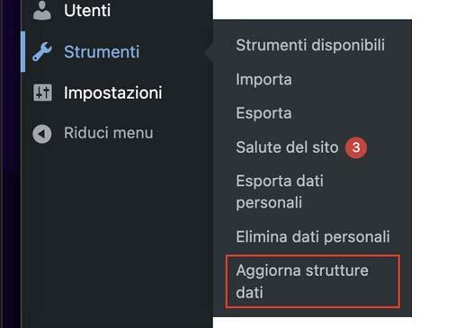
*Menu Strumenti > Aggiorna strutture dati*

#### Cosa viene aggiornato

Quando si esegue l'aggiornamento, il sistema sincronizza automaticamente:

- **Tipologie di post** (custom post types)
- **Tassonomie** (categorie, argomenti, focus, ecc.)
- **Options** (configurazioni e impostazioni)
- **File di definizione** (`comuni_tipologie.json`, `comuni_pagine.json`)

I file vengono scaricati dalla repository ufficiale e salvati localmente nella cartella:

```
/inc/origin-tema-comuni/
├── tipologie/
├── tassonomie/
├── options/
├── comuni_tipologie.json
└── comuni_pagine.json
```

#### Personalizzazione avanzata: disattivare l'aggiornamento automatico

Se si desidera utilizzare **content type completamente personalizzati** senza sincronizzazione con il tema Design Italia, è possibile disattivare la funzione di aggiornamento automatico.

**Procedura:**

1. Aprire il file del tema:
   ```
   /design_umbria_prossima/inc/functions/update-origin-theme-dataset.php
   ```

2. Commentare le righe da **3 a 12** che registrano il menu di aggiornamento:
   ```php
   // add_action('admin_menu', function () {
   //     add_submenu_page(
   //         'tools.php',
   //         'Aggiorna strutture dati',
   //         'Aggiorna strutture dati',
   //         'manage_options',
   //         'importa-sezioni-tema',
   //         'pagina_import_sezioni'
   //     );
   // });
   ```

3. Modificare manualmente i content type nelle seguenti cartelle:
   - **Tipologie**: `/inc/origin-tema-comuni/tipologie/`
   - **Tassonomie**: `/inc/origin-tema-comuni/tassonomie/`
   - **Options**: `/inc/origin-tema-comuni/options/`

> **⚠️ Attenzione:** Disattivando l'aggiornamento automatico, si perde la sincronizzazione con gli aggiornamenti ufficiali del tema Design Italia. Questa operazione è consigliata solo per sviluppatori esperti che necessitano di personalizzazioni avanzate non compatibili con il modello standard.

---

## **Da dove iniziare**

Dopo l'installazione, il sito si presenta come una struttura vuota, pronta per essere configurata e popolata con i contenuti.

### Configurazione delle tassonomie

Le sezioni e le pagine del portale dipendono dalla creazione progressiva dei contenuti e dalla corretta definizione delle **tassonomie**, che permettono di classificare e collegare tra loro le diverse informazioni.

Tramite le tassonomie si possono definire, ad esempio:

- **Tipi di notizia** (es. Notizie, Comunicazioni, Avvisi, Eventi): da `Notizie > Tipi di Notizia`;
- **Argomenti** (es. Ambiente, Cultura, Istruzione): da `Notizie > Argomenti` o `Eventi > Argomenti`;
- **Focus**: classificazione aggiuntiva nata dall'esperienza del progetto Prossima Regione Umbria;
- **Altri**: Tipi di Eventi, Tipi di Documento, Licenze, Tipi di Unità Organizzativa, ecc.

> **Importante:** È necessario configurare e popolare le tassonomie prima di procedere con l'inserimento dei contenuti veri e propri.

### Ordine consigliato per la creazione dei contenuti

Poiché molti content type prevedono campi obbligatori e relazioni reciproche, si consiglia di iniziare in questo ordine:

**Prima fase:**

1. Punti di contatto
2. Persone pubbliche
3. Luoghi
4. Unità organizzative

**Seconda fase:**

5. Documenti pubblici
6. Dataset
7. Eventi
8. Notizie
9. Fasi
10. Servizi

### Modifica Favicon

Per modificare la favicon del sito, accedere al menu:

**`Impostazioni > Generali`** → sezione "Icona del sito"

---

## **Impostazioni Template**

La sezione **"Impostazioni Template"** rappresenta l'area principale per la gestione delle impostazioni di base del sito web.

All'interno sono presenti i seguenti tab di configurazione:

- [Permessi](#permessi)
- [Globali](#globali)
- [Header](#header)
- [Footer](#footer)
- [Homepage](#homepage)
- [Single Page](#single-page)
- [Taxonomy Page](#taxonomy-page)
- [Category Page](#category-page)

### Permessi

> **Importante:** Dopo l'installazione iniziale, come prima operazione, accedere a **`Impostazioni Template > Permessi`**.

L'utente amministratore non dispone automaticamente dell'accesso ai vari tipi di post (Notizie, Servizi, Comuni, ecc.).

Da questa sezione è possibile:

- selezionare uno o più tipi di post (content type);
- definire quali ruoli possono accedervi.

Il sistema consente di aggiungere più associazioni cliccando sul pulsante **"Aggiungi associazione"**.

> **Nota:** Per la configurazione completa dei ruoli editoriali, vedere la sezione [Gestione ruoli e permessi](#gestione-ruoli-e-permessi).

### Globali

Accedendo a **`Impostazioni Template > Globali`**, è possibile:

- **Inserire il logo** dell'ente;
- **Definire il nome del sito** e un eventuale sottotitolo;
- **Aggiungere i link ai social network** per i quali è attiva una pagina ufficiale;
- **Modificare la palette cromatica** tramite il menu a tendina "Colore del tema" (i colori disponibili sono validati per il contrasto);
- **Attivare un Alert Globale** visibile in tutte le pagine del sito (selezionando tipo e messaggio).

### Header

In questa sezione è possibile:

- Mostrare i canali social nell'header del sito;
- Mostrare l'ente di appartenenza, impostando nome e link;
- **Gestire le voci del menu principale e secondario** tramite inserimento di:
  - Label
  - Link di destinazione (alias)
  - Eventuale icona

### Footer

In questa sezione è possibile:

- Visualizzare i canali social nel footer;
- **Aggiungere e riorganizzare le colonne**, definendo per ciascuna:
  - Nome della colonna
  - Elenco dei contenuti (label + link interno/esterno)
  - Opzione per visualizzare immagini con link

### Homepage

Da questo tab è possibile configurare l'homepage del sito web:

- **Alert specifico per la homepage** (oltre agli alert globali);
- **Sezione di ricerca** con:
  - Bottoni di ricerca rapida personalizzabili
  - Immagine di sfondo
  - Titolo e link (visualizzato in basso a destra dell'immagine)
- **Immagini hero multiple** che si alternano all'aggiornamento della pagina

> Per completare la costruzione della homepage, consultare la sezione [Aggiungi una sezione con un elenco](#aggiungi-una-sezione-con-un-elenco).

### Single Page

Ogni content type (Notizie, Servizi, Eventi, Documenti, ecc.) prevede la compilazione dei campi definiti dal modello Design Italia.

**Campo aggiuntivo "link esterno":** se compilato, il clic su una card del contenuto reindirizzerà al link esterno invece che alla pagina del post.

Da **`Impostazioni Template > Single Page`** è possibile:

- Selezionare il content type dal menu a tendina;
- Configurare i **contenuti correlati** da mostrare nella pagina (in griglia o carosello);

> **Importante:** La configurazione si applica a tutte le pagine di quella tipologia, non al singolo elemento.

### Taxonomy Page

La Taxonomy Page consente di associare contenuti alle pagine di atterraggio delle principali tassonomie (Tipi di Notizia, Argomenti, Focus, ecc.).

È possibile configurare:

- **Alert di categoria** (attivazione, tipo e messaggio);
- **Sezioni personalizzate** tramite il componente "Aggiungi una sezione con un elenco".

### Category Page

Le categorie sono gestite come vere e proprie categorie WordPress. L'elenco completo è disponibile in **`Articoli > Categorie`**.

**Impostazioni di base per ogni categoria:**

- **Slug** (alias di atterraggio)
- **Descrizione** breve
- **Icona** associata
- **Link esterno** (reindirizzerà al link invece del contenuto interno)

> **Nota sui permalink:** Se visualizzando gli alias dovesse comparire "Pagina non trovata", andare su **`Impostazioni > Permalink`**, selezionare "Struttura personalizzata" e impostare:
> ```
> /%category%/%postname%/
> ```

**Configurazione della visualizzazione:**

Da **`Category Page`** è possibile selezionare la categoria e decidere cosa visualizzare:

- **Post Type associato**
- **Mostra sottocategorie nell'header** (a destra)
- **Mostra le sottocategorie in pagina** (come card)
- **Mostra elenco contenuti** (dei post del tipo selezionato)
- **Mostra filtri contenuti** (a sinistra dell'elenco)
- **Mostra ricerca contenuti** (campo di ricerca per parola chiave)
- **Alert di categoria** (attivazione, tipo e messaggio)

**Esempio di pagina categoria:**

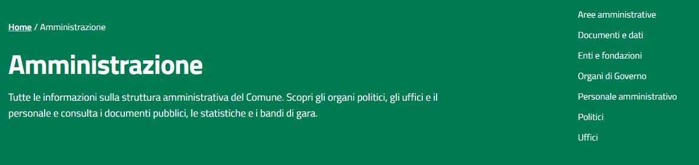
*Esempio di pagina categoria "Amministrazione" con sottocategorie*

---

## **Aggiungi una sezione con un elenco**

Il componente **"Aggiungi una sezione con un elenco"** è uno dei più versatili dell'applicazione. È utilizzabile in Homepage, Single Page, Taxonomy Page e Category Page.

### Esempio 1: Sezione Notizie in homepage

```
Titolo sezione: Notizie
Posizione titolo: centro
Label piè di sezione: Tutte le notizie
Link piè di sezione: /novita
Layout: Griglia
Cosa vuoi selezionare?: seleziona post
Tipologia di Post: Notizia
Tipologia di Card: Card Notizia Standard
Filtra per: I più recenti
```

**Risultato frontend:**

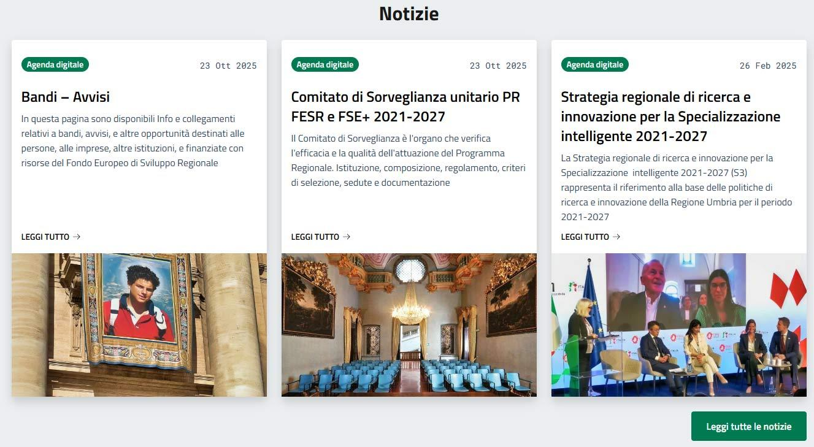
*Esempio di sezione Notizie in homepage con layout a griglia*

### Esempio 2: Sezione Argomenti in homepage

```
Titolo sezione: Argomenti
Posizione titolo: centro
Label piè di sezione: Tutti gli argomenti
Mostra come bottone: ✓
Link piè di sezione: /argomenti
Layout: Griglia
Cosa vuoi selezionare?: seleziona tassonomie
Seleziona Tassonomia: Argomento
Tipologia Card (tassonomia): Card Argomento Standard
Seleziona Termini: [spuntare i termini desiderati]
```

**Risultato frontend:**

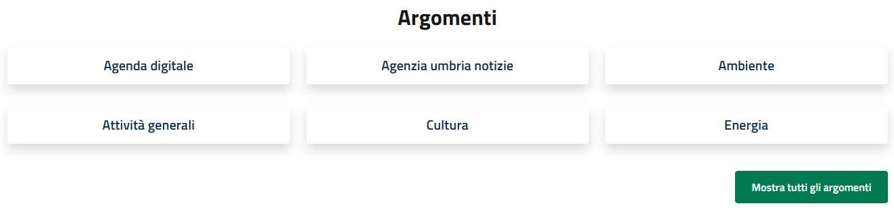
*Esempio di sezione Argomenti in homepage*

### Esempio 3: Sezione Focus in homepage

```
Titolo sezione: Focus
Posizione titolo: centro
Layout: Griglia
Cosa vuoi selezionare?: seleziona tassonomie
Seleziona Tassonomia: Focus
Tipologia Card (tassonomia): Card Focus Standard
Seleziona Termini: [spuntare i termini desiderati]
```

**Risultato frontend:**

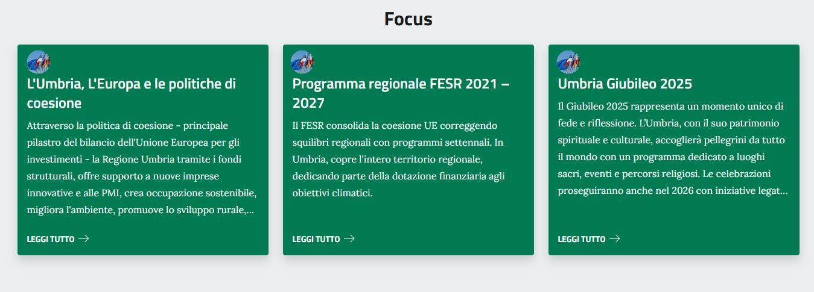
*Esempio di sezione Focus in homepage*

### Esempio 4: Campagne di Comunicazione (Carosello)

```
Titolo sezione: Campagne di Comunicazione istituzionale
Posizione titolo: centro
Layout: Carosello
Scorrimento: scorrimento con frecce
Cosa vuoi selezionare?: seleziona post
Tipologia di Post: qualsiasi post
Tipologia Card: Card Immagine Background
Filtra per: selezione manuale
Seleziona Post (manuale): [cercare e selezionare i post]
```

**Risultato frontend:**

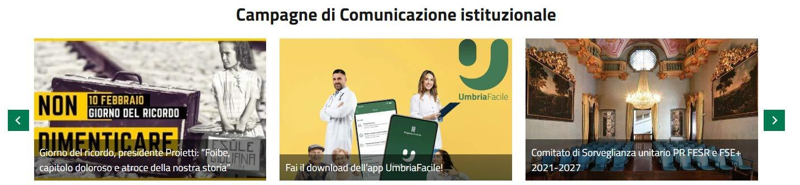
*Esempio di sezione con carosello per Campagne di Comunicazione*

**Configurazione backend:**

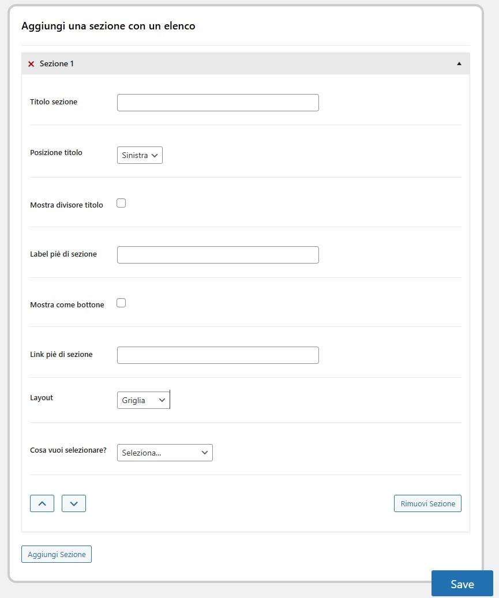
*Form di configurazione "Aggiungi una sezione con un elenco"*

### Opzioni principali del componente

| Campo | Descrizione |
|-------|-------------|
| **Titolo sezione** | Titolo visualizzato sopra la sezione |
| **Posizione titolo** | Allineamento (sinistra, centro, destra) |
| **Mostra divisore titolo** | Linea decorativa sotto il titolo |
| **Label piè di sezione** | Testo del link/bottone finale |
| **Mostra come bottone** | Stile button invece di link |
| **Link piè di sezione** | URL di destinazione |
| **Layout** | Griglia o Carosello |
| **Cosa vuoi selezionare?** | Post, Categorie o Tassonomie |
| **Tipologia Card** | Stile di visualizzazione (Standard, Immagine Background, ecc.) |
| **Filtra per** | I più recenti, Per tassonomia, Selezione manuale |

---

## **Gestione ruoli e permessi**

All'interno del tema è stata aggiunta una pagina dedicata alla gestione avanzata dei ruoli e dei permessi, accessibile da:

**`Utenti > Gestione Ruoli Editoriali`**

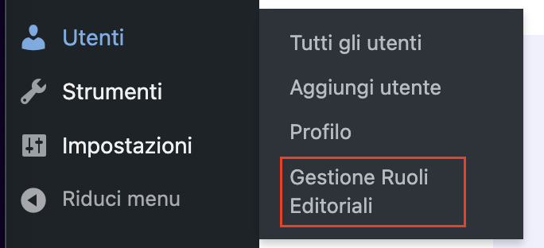
*Accesso al menu Gestione Ruoli Editoriali*

### Funzionalità disponibili

- **Creare nuovi ruoli editoriali** personalizzati;
- **Definire le capabilities** (azioni consentite: creare, modificare, eliminare, pubblicare);
- **Scegliere la modalità di accesso**:
  - "di qualsiasi utente" (gestione contenuti di tutti)
  - "solo i suoi post" (solo propri contenuti)

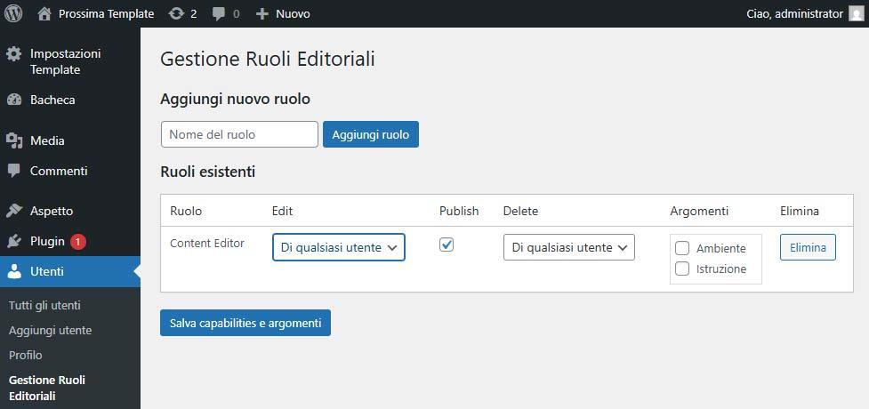
*Interfaccia di gestione capabilities e argomenti per ruolo*

### Permessi basati su argomenti

È possibile limitare i permessi di modifica ed eliminazione in base agli **argomenti**.

Anche se un ruolo ha il permesso generale di modificare post di qualsiasi utente, l'amministratore può restringere tali azioni solo a determinati argomenti selezionandoli tramite spunte.

> **Nota:** Dopo l'installazione, la sezione Argomenti sarà vuota e dovrà essere popolata prima di assegnare permessi specifici.

Una volta definito il ruolo, è possibile attribuirlo all'utente WordPress in fase di creazione o modifica.

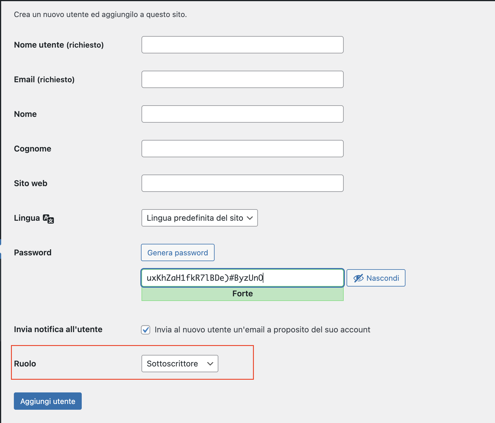
*Selezione del ruolo in fase di creazione/modifica utente*

---

## **Ottimizzazione immagini e gestione focal point**

### Conversione automatica in WebP

L'applicazione converte automaticamente tutte le immagini caricate nella libreria media in formato **WebP**, senza plugin esterni, garantendo:

- Riduzione delle dimensioni dei file
- Tempi di caricamento più rapidi
- Migliori performance complessive

### Gestione del Punto Focale

È stato sviluppato un componente dedicato alla gestione del **focal point** delle immagini.

**Come utilizzarlo:**

1. Caricare o selezionare un'immagine dalla libreria media;
2. Nella parte inferiore destra della schermata, cliccare su **"Seleziona Punto Focale"**;


*Pulsante "Seleziona Punto Focale" nella libreria media*

3. Fare clic sul punto desiderato dell'immagine;
4. Il pallino rosso indicherà il punto focale impostato.

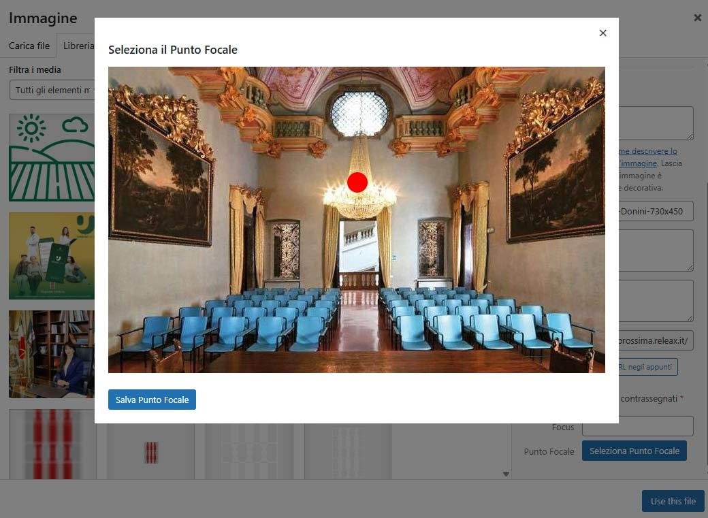
*Interfaccia di selezione del punto focale con indicatore rosso*

Il sistema manterrà centrata e visibile quest'area nelle varie risoluzioni (desktop e mobile), evitando ritagli automatici indesiderati e garantendo che gli elementi principali (volti, dettagli rilevanti) restino sempre correttamente inquadrati.


---

## **FAQ**

### ❓ Chi può richiedere il template?

Gli enti locali, comuni e strutture della Pubblica Amministrazione che operano sotto il coordinamento della Regione Umbria possono richiedere il pacchetto di installazione.

### ❓ Il template è conforme alle normative AGID?

Sì, il template adotta Bootstrap Italia e rispetta le Linee guida AGID e i requisiti di accessibilità WCAG 2.1.

### ❓ È possibile personalizzare il template?

Sì, il template è progettato per essere configurabile. È possibile personalizzare colori, contenuti, menu e layout senza modificare il codice.

### ❓ Come si aggiorna il template?

Gli aggiornamenti delle strutture dati possono essere integrati dalla sezione `Strumenti > Aggiorna strutture dati`, che scarica automaticamente le novità da Design Italia mantenendo le personalizzazioni locali.

### ❓ Posso migrare da un altro tema WordPress?

Sì, è possibile migrare contenuti da altri temi WordPress. Si consiglia di pianificare la migrazione con attenzione, mappando i content type esistenti con quelli del template.

### ❓ Il template supporta multilingua?

Il template è predisposto per l'italiano. Per il supporto multilingua è necessario valutare l'integrazione di plugin dedicati compatibili.

### ❓ Come ottimizzare le performance?

Il template include già ottimizzazioni come la conversione automatica in WebP. Per ulteriori miglioramenti, si consiglia l'uso di plugin di caching (es. WP Super Cache, W3 Total Cache) e un CDN.

### ❓ Posso usare il template per siti non istituzionali?

Il template è progettato specificamente per siti istituzionali della PA. L'uso per altri scopi richiede una valutazione della compatibilità con le proprie esigenze.

### ❓ Posso creare content type personalizzati diversi da quelli di Design Italia?

Sì, ci sono due approcci:

1. **Aggiungere nuovi content type** mantenendo quelli esistenti e la sincronizzazione con Design Italia
2. **Disattivare l'aggiornamento automatico** (commentando le righe 3-12 in `/inc/functions/update-origin-theme-dataset.php`) e modificare completamente i content type in `/inc/origin-tema-comuni/`

Il secondo approccio è consigliato solo per sviluppatori esperti, poiché si perde la compatibilità con gli aggiornamenti ufficiali.

### ❓ Cosa succede ai miei contenuti quando aggiorno le strutture dati?

L'aggiornamento delle strutture dati **non elimina né modifica i contenuti esistenti**. Vengono aggiornate solo le definizioni dei content type (campi, tassonomie, configurazioni), mentre tutti i post, pagine e media rimangono intatti.

---

## **Bootstrap Italia**

Il template rispetta le linee guida di design dell'Agenzia per l'Italia digitale rilasciate dal [**Team per la Trasformazione Digitale**](https://teamdigitale.governo.it/) e le caratteristiche per i servizi web della Pubblica Amministrazione contenute nel Piano triennale per l'informatica.

Nel tema vengono integrate le componenti di [**Bootstrap Italia**](https://italia.github.io/bootstrap-italia/).

---

## **Licenze**

### Componenti di terze parti

Il template utilizza i seguenti componenti open source:

- **[CMB2](https://github.com/CMB2/CMB2)** © Justin Sternberg, licenza GNU GPL v3.0
- **[CMB2-conditional-logic](https://github.com/awran5/CMB2-conditional-logic/)** © Ahmed Khalil, licenza GNU GPL v2.0
- **[CMB2-field-Leaflet-Geocoder](https://github.com/villeristi/CMB2-field-Leaflet-Geocoder)** © Ville Ristimäki, licenza MIT
- **[cmb-field-select2](https://github.com/mustardBees/cmb-field-select2)** © Phil Wylie, licenza GNU GPL v3.0
- **[cmb2-attached-posts](https://github.com/CMB2/cmb2-attached-posts)** © Justin Sternberg, licenza GNU GPL v3.0
- **[TGM-Plugin-Activation](https://github.com/TGMPA/TGM-Plugin-Activation)** © Gary Jones, licenza GNU GPL v2.0
- **[Bootstrap Italia](https://italia.github.io/bootstrap-italia/)** © Team Digitale, licenza BSD-3-Clause

### Licenza del template

This program is free software: you can redistribute it and/or modify it under the terms of the **GNU Affero General Public License** as published by the Free Software Foundation, either version 3 of the License, or (at your option) any later version.

This program is distributed in the hope that it will be useful, but WITHOUT ANY WARRANTY; without even the implied warranty of MERCHANTABILITY or FITNESS FOR A PARTICULAR PURPOSE. See the GNU Affero General Public License for more details.

You should have received a copy of the GNU Affero General Public License along with this program. If not, see <http://www.gnu.org/licenses/>

---

## **Crediti**

Template sviluppato sulla base dell'esperienza del portale [prossima.regione.umbria.it](https://prossima.regione.umbria.it)

Conforme alle linee guida [Designers Italia](https://designers.italia.it/) e al framework [Bootstrap Italia](https://italia.github.io/bootstrap-italia/)

---

**Versione:** 1.0  
**Compatibilità WordPress:** 6.8.3  
**Ultima modifica:** Novembre 2025
